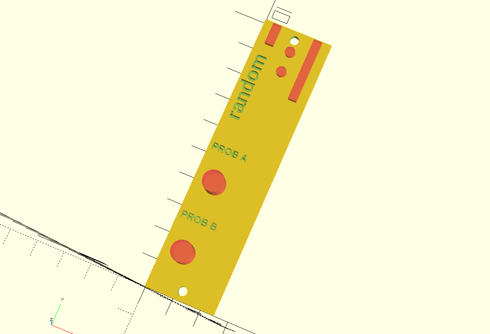

# Random
[![CC BY 4.0][cc-by-shield]][cc-by]

Generates randomized gates based on a probability knob. Module based on [robstave's ACS-85-0613 "Coin Flip"](https://github.com/robstave/ArduinoComponentSketches/tree/master/ACS-85%20ATTiny85%20sketches/ACS-85-0613).

Has one clock input and two channels with independent probability controls.

## Circuit
[TODO]

## Panel
The frontpanel I used for my build was 3D printed in PLA and designed using my [AEPanelMaker library for OpenSCAD](https://github.com/benjiaomodular/AEPanelMaker). I built the circuit on perfboard.

## LICENSE
This work is licensed under a
[Creative Commons Attribution 4.0 International License][cc-by].

[cc-by]: http://creativecommons.org/licenses/by/4.0/
[cc-by-shield]: https://img.shields.io/badge/License-CC%20BY%204.0-lightgrey.svg
