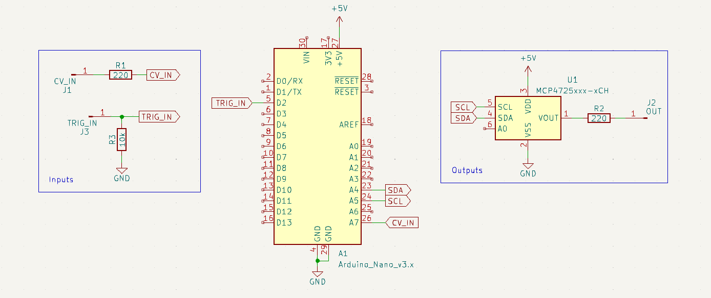

# Quantizer

This is a minimal quantizer based on the Arduino Nano.

## Circuit
Original code and circuit was based on [HAGIWO's DIY Quantizer build](https://note.com/solder_state/n/nde97a0516f03).

This version is stripped down with no frontpanel controls and is fixed to one scale. I intend to expand this in the future.

## LICENSE
All work under this collection is licensed under a
[Creative Commons Attribution 4.0 International License][cc-by], unless noted otherwise.

[cc-by]: http://creativecommons.org/licenses/by/4.0/
[cc-by-shield]: https://img.shields.io/badge/License-CC%20BY%204.0-lightgrey.svg
