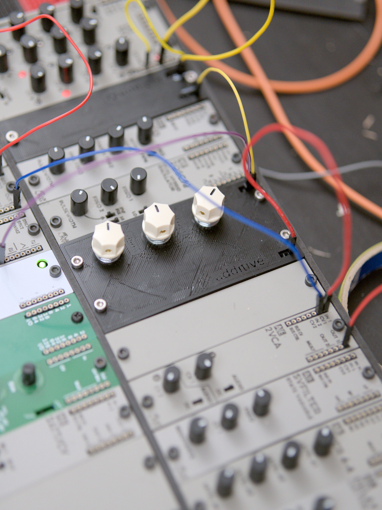
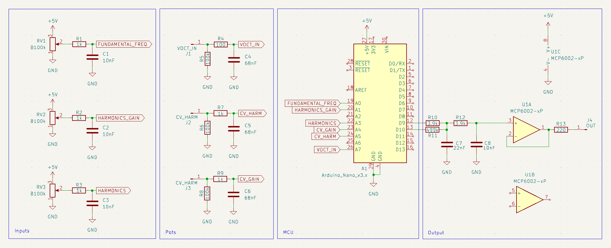

# AdditiveVCO
An Arduino VCO based on [HAGIWO's Additive VCO project](https://note.com/solder_state/n/n30b3a8737b1e).

## Circuit

## LICENSE
All work under this collection is licensed under a
[Creative Commons Attribution 4.0 International License][cc-by], unless noted otherwise.

[cc-by]: http://creativecommons.org/licenses/by/4.0/
[cc-by-shield]: https://img.shields.io/badge/License-CC%20BY%204.0-lightgrey.svg
